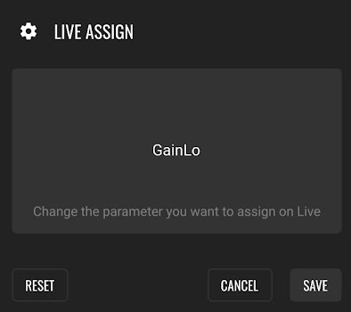

# Midi Controller Module

This module is composed of several screen controls distributed through 8 columns per bank; each column has a **knob**, a **button**, a **fader** and a **pad**.

With four banks available, this means you have 32 programmable controls per bank, to a total of 128.

As all modules (except Matrix) it has two modes: the **MIDI mode**, that can be used to control MIDI (external hardware, apps, etc), and the **Live mode**, which can be used to control Ableton Live parameters.

Note that these two modes can be used alternatively, giving you the possibility to control Ableton Live and MIDI, each with different channels and control assignments.

Depending on the mode selected, you will find different sections in the status bar at the top of the screen:

- **MODE** - allows toggling between Live and MIDI modes
- **DEVICE** - selects the output MIDI device (MIDI mode only)
- **CHANNEL** - chooses the MIDI output channel (MIDI mode only)
- **CC** - shows the CC assigned to the selected screen control (MIDI mode only)
- **SELECTED TRACK** - selects the MIDI track controlled by the MIDI pads (Live mode only).
- **TRACK ARMED** - toggles record arm on track ON or OFF (Live mode only).
- **REC. QUANT.** - enable and choose record quantization (Live mode only).
- **PARAMETER** - shows the parameter assigned to the selected screen control (Live mode only)
- **VALUE** - shows the value of data transmitted by the selected screen control.

At the bottom of the screen, a split view can be opened by dragging the green line in the middle of the bar or by tapping anywhere else on the bar. This menu gives access to the following module settings:

- **BANKS** - four independent and customizable banks.
- **RENAME** - change the label name of a controller.
- **ASSIGN** - allows mapping of a CC.

By default, the CC values are distributed in an ascending order in each column and bank, from 0 to 128. This means that the first screen control of bank A is by default mapped to CC 0, while the last screen control, on bank D is by default mapped to CC 128. Nevertheless, all these parameters can be customized, giving you the possibility to adapt this section to your needs.

## Assigning a custom MIDI CC

To customize the MIDI mapping (MIDI mode), the assign key must be pressed while pressing the screen controller intended for mapping. This will open a list of CC values available - press the number of the value you want to map and press OK to confirm. To reset a CC, open the assign window and choose Reset at the bottom.

## Assigning an Ableton Live Parameter

To customize the parameters in Live mode, select the screen control you want to map, then press ASSIGN. Change the parameter you want assign on Ableton Live or using the [Matrix](matrix) devices section. The name of the parameter will be displayed in the screen, press OK to confirm.

In any case it is possible to return to the default CC mapping by pressing ASSIGN and then RESET.

[Learn all about the XY-Pad Module.](xy-pad)
